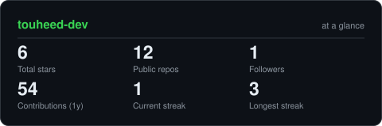
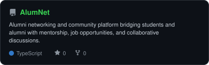
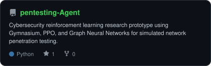
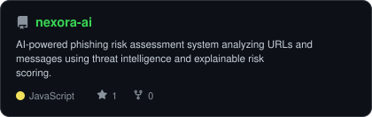
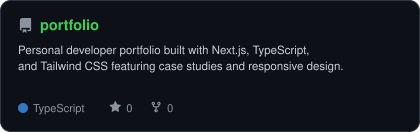

<div align="center">

<!-- PORTRAIT - generated by scripts/dotify.py from assets/avatar.jpg.
     Colour mode, so one file serves both GitHub themes. Regenerate with:
       python scripts/dotify.py assets/avatar.jpg -o assets/portrait \
         --cols 100 --equalize --detail 0.5 --color --reveal -->


<br>

<!-- NAME / TAGLINE - animated typing -->
<a href="https://github.com/touheed-dev">
  
</a>

<br>

<!-- SOCIALS -->
<a href="https://www.linkedin.com/in/touheedshaikh"></a>
<a href="mailto:shaikhtouheed05@gmail.com"></a>
<a href="https://touheed.dev"></a>


</div>

---

## `~/` whoami

```console
$ cat about.txt
```

Hi, I'm **Touheed Shaikh**. I'm an AI & Data Science student and software engineer focused on building scalable web applications, backend systems, and clean developer tooling.

- 🚀 Currently building **[AlumNet](https://github.com/touheed-dev/AlumNet)** *(Alumni networking & community platform)*
- 🌐 Portfolio: **[touheed.dev](https://touheed.dev)**
- 🧠 Focus: **Backend Architecture, Full-Stack Development & AI**
- 💬 Ask me about: **TypeScript, Python, C++, React, and APIs**

<br>

<div align="center">

## `~/` toolbox


</div>

---

<div align="center">

## `~/` skill radar

<table>
<tr>
<td width="50%" align="center" valign="middle">

<!-- Self-rated radar - edit assets/skills.json, the workflow redraws it -->
<picture>
  <source media="(prefers-color-scheme: dark)"  srcset="assets/radar-dark.svg">
  <source media="(prefers-color-scheme: light)" srcset="assets/radar-light.svg">
  
</picture>

</td>
<td width="50%" align="center" valign="middle">

<!-- Live radar built from real language byte counts across your repos -->
<picture>
  <source media="(prefers-color-scheme: dark)"  srcset="assets/radar-langs-dark.svg">
  <source media="(prefers-color-scheme: light)" srcset="assets/radar-langs-light.svg">
  
</picture>

</td>
</tr>
</table>

</div>

---

<div align="center">

## `~/` contribution calendar

<!-- 3D isometric calendar, regenerated every 6h by .github/workflows/metrics.yml -->


<br><br>

<!-- Snake eats the contribution graph - .github/workflows/snake.yml -->
<picture>
  <source media="(prefers-color-scheme: dark)"  srcset="https://raw.githubusercontent.com/touheed-dev/touheed-dev/output/snake-dark.svg">
  <source media="(prefers-color-scheme: light)" srcset="https://raw.githubusercontent.com/touheed-dev/touheed-dev/output/snake.svg">
  
</picture>

</div>

---

<div align="center">

## `~/` the numbers

<!-- Generated by scripts/cards.py into this repo -->
<picture>
  <source media="(prefers-color-scheme: dark)"  srcset="assets/card-stats-dark.svg">
  <source media="(prefers-color-scheme: light)" srcset="assets/card-stats-light.svg">
  
</picture>

<br>


<br><br>


</div>

---

<div align="center">

## `~/` selected work

<!-- Cards generated by scripts/cards.py from assets/projects.json -->
<table>
<tr>
<td width="50%">
  <a href="https://github.com/touheed-dev/AlumNet">
    <picture>
      <source media="(prefers-color-scheme: dark)"  srcset="assets/card-AlumNet-dark.svg">
      <source media="(prefers-color-scheme: light)" srcset="assets/card-AlumNet-light.svg">
      
    </picture>
  </a>
</td>
<td width="50%">
  <a href="https://github.com/touheed-dev/pentesting-Agent">
    <picture>
      <source media="(prefers-color-scheme: dark)"  srcset="assets/card-pentesting-Agent-dark.svg">
      <source media="(prefers-color-scheme: light)" srcset="assets/card-pentesting-Agent-light.svg">
      
    </picture>
  </a>
</td>
</tr>
<tr>
<td width="50%">
  <a href="https://github.com/touheed-dev/nexora-ai">
    <picture>
      <source media="(prefers-color-scheme: dark)"  srcset="assets/card-nexora-ai-dark.svg">
      <source media="(prefers-color-scheme: light)" srcset="assets/card-nexora-ai-light.svg">
      
    </picture>
  </a>
</td>
<td width="50%">
  <a href="https://github.com/touheed-dev/portfolio">
    <picture>
      <source media="(prefers-color-scheme: dark)"  srcset="assets/card-portfolio-dark.svg">
      <source media="(prefers-color-scheme: light)" srcset="assets/card-portfolio-light.svg">
      
    </picture>
  </a>
</td>
</tr>
</table>

<sub>

| project | description | stack |
|---|---|---|
| **[AlumNet](https://github.com/touheed-dev/AlumNet)** | Alumni networking & community engagement platform | `Next.js` `TypeScript` `Node.js` |
| **[pentesting-Agent](https://github.com/touheed-dev/pentesting-Agent)** | Autonomous penetration testing RL agent | `Python` `Gymnasium` `PPO` `GNN` |
| **[nexora-ai](https://github.com/touheed-dev/nexora-ai)** | AI phishing risk & threat assessment system | `JavaScript` `Node.js` `AI` |
| **[portfolio](https://github.com/touheed-dev/portfolio)** | Developer portfolio with case studies & responsive design | `Next.js` `TypeScript` `Tailwind CSS` |

</sub>

</div>

---

<div align="center">

<sub>`01110100 01101000 01100001 01101110 01101011 01110011 00100000 01100110 01101111 01110010 00100000 01110011 01100011 01110010 01101111 01101100 01101100 01101001 01101110 01100111`</sub>

</div>
